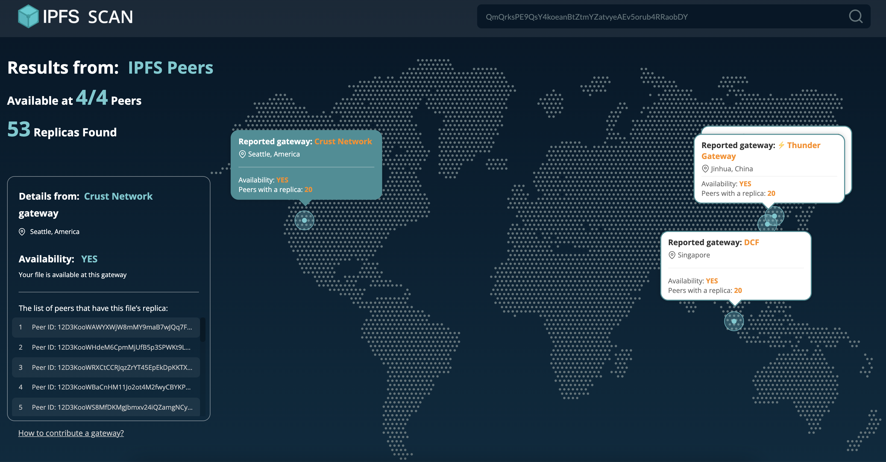

# IPFS Public Gateway Endpoints

You can contribute your IPFS gateway to `IPFS SCAN`, it will show availability and connected providing peers for queried CIDs as other gateways, like below:



## Contribution Step

### 1. Run IPFS Public Gateway

1. You can refer [this doc](https://docs.ipfs.io/concepts/ipfs-gateway/#gateway-types) to learn the concept of IPFS public gateway

2. Then, you can refer [this doc](https://docs.ipfs.io/how-to/configure-node/#gateway) to config an IPFS gateway node


### 2. Open APIs to `IPFS SCAN`

`IPFS SCAN` uses some builtin IPFS APIs to check availability and connected providing peers for CIDs, so please make sure they could be accessed by `IPFS SCAN`:

- [/api/v0/dag/get](https://docs.ipfs.io/reference/http/api/#api-v0-dag-get)
- [/api/v0/dht/findprovs](https://docs.ipfs.io/reference/http/api/#api-v0-dht-findprovs)


### 3. Propose a PR

Please fork this repo, and add your gateway to `constants.ts` with the following format

```typescript
{
  id: 1,
  name: "Crust Network",
  city: "Seattle",
  country: "America",
  value: "https://crustwebsites.net"
},
// id:       your gateway index number
// name:     your gateway name
// city:     your gateway location city
// counttry: your gateway location country
// value:    your gateway url
```

Then, after your PR is merged, you'll see your gateway on [IPFS SCAN](https://ipfsscan.crustapps.net) for queried CIDs.
